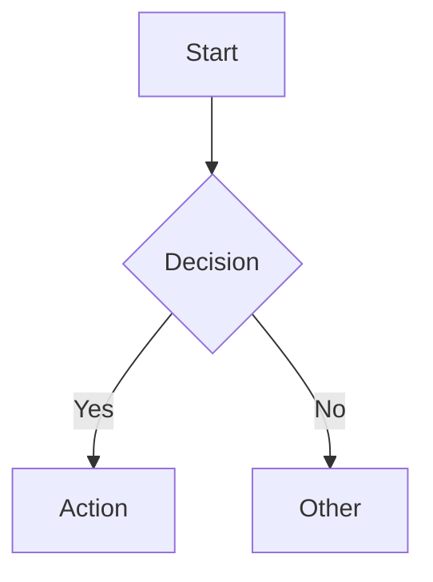

# Markdown Syntax Reference

Elastic Docs V3 uses MyST (Markedly Structured Text) Markdown. It supports GitHub Flavored Markdown tables and strikethrough but NOT task lists, automatic URL linking, or HTML (except `<br>`).

## Directives

Directives are the building blocks of custom syntax. They open and close with `:::`:

```markdown
:::{directive-name} argument
:option: value

Content goes here.
:::
```

Nest directives by adding more colons (4 for outer, 3 for inner):

```markdown
::::{outer-directive}
:::{inner-directive}
Content
:::
::::
```

Exception: Code blocks and `applies_to` blocks use backticks, not colons.

## Headings

```markdown
# Page Title (H1) — exactly one per page, always first
## Section (H2)
### Subsection (H3)
#### H4
##### H5
###### H6
```

- Anchors auto-generate from heading text: `## My Section` → `#my-section`
- Custom anchors: `## My Section [custom-id]` → `#custom-id`
- Don't use headings inside directives (breaks table of contents).

## Inline Formatting

```markdown
**bold text**
_italic text_
`inline code`
~~strikethrough~~
H~2~O (subscript)
4^th^ (superscript)
\*escaped special chars\*
```

## Links

```markdown
[Link text](relative/path/file.md)              <!-- relative internal -->
[Link text](relative/path/file.md#anchor)        <!-- internal with anchor -->
[Link text](/absolute/path/file.md)              <!-- absolute internal -->
[Link text](#section-anchor)                     <!-- same-page anchor -->
[Link text](repo://path/file.md)                 <!-- cross-repo link -->
[Link text](https://example.com)                 <!-- external link -->
[](file.md)                                      <!-- auto-title from target -->
```

- Never use full URLs for internal docs links.
- Bare `https://` URLs auto-convert to links.
- Reference-style links: `[text][ref]` with `[ref]: url` at document end.

## Images

```markdown
                   <!-- basic image -->
```

Directive form for more control:

```markdown
:::{image} path/to/image.png
:alt: Descriptive alt text
:screenshot:
:width: 500px
:::
```

- `:screenshot:` adds box-shadow styling.
- Sizing: absolute (`500px`) or relative (`80%`).
- Images must be within the docset folder.
- SVG and GIF are supported.

Image carousel:

```markdown
:::::{carousel}
:::{image} img1.png
:alt: First image
:::
:::{image} img2.png
:alt: Second image
:::
:::::
```

## Admonitions

```markdown
:::{note}
Relevant information with no serious consequences if ignored.
:::

:::{warning}
Risk of data loss or security issues.
:::

:::{tip}
Advice for making better choices.
:::

:::{important}
Could impact performance or system stability.
:::

:::{admonition} Custom Title
Styled callout with a custom title.
:::
```

## Code Blocks

````markdown
```yaml
setting:
  enabled: true
```
````

Always specify the language identifier for syntax highlighting.

### Code Callouts

Explicit callouts with numbered markers:

````markdown
```java
String name = "Elastic"; // <1>
System.out.println(name); // <2>
```
1. Assigns the name variable
2. Prints the value
````

Code comments auto-convert to callouts. Disable with `callouts=false`:

````markdown
```python callouts=false
# This comment stays as-is
x = 1
```
````

### Console Blocks

For API requests (first line is the command, rest is JSON body):

````markdown
```console
GET _search
{
  "query": { "match_all": {} }
}
```
````

### Substitutions in Code

Enable with `subs=true`:

````markdown
```sh subs=true
curl https://{{url}}
```
````

Inline code with substitutions: `` {subs}`{{variable}} value` ``

## Tables

```markdown
| Header 1 | Header 2 | Header 3 |
| --- | --- | --- |
| Cell 1 | Cell 2 | Cell 3 |
| Cell 4 | Cell 5 | Cell 6 |
```

- Always include header row.
- No block-level elements inside cells.
- Wide tables auto-scroll horizontally.

For CSV data, use the csv-include directive:

```markdown
:::{csv-include} path/to/data.csv
:separator: ;
:caption: Table caption
:::
```

## Lists

```markdown
- Unordered item (also `*` or `+`)
- Another item
  - Nested item (indent 4 spaces)

1. Ordered first step
2. Second step
   1. Sub-step (indent 4 spaces)
```

Content within list items must be indented by 4 spaces:

```markdown
1. First step

    Additional paragraph for step 1.

    ```yaml
    code: block
    ```

2. Second step
```

## Tabs

```markdown
::::{tab-set}
:::{tab-item} Python
Python content here.
:::
:::{tab-item} JavaScript
JavaScript content here.
:::
::::
```

Sync tabs across tab-sets on the same page:

```markdown
::::{tab-set}
:group: languages
:::{tab-item} Python
:sync: python
Content
:::
:::{tab-item} JavaScript
:sync: js
Content
:::
::::
```

## Dropdowns

```markdown
:::{dropdown} Click to expand
Hidden content revealed on click.
:::

:::{dropdown} Open by default
:open:
This content is visible initially.
:::
```

## Stepper

For sequential tutorial steps:

```markdown
:::::{stepper}
::::{step} Set up the environment
Instructions for step 1.
::::
::::{step} Configure the agent
Instructions for step 2.
::::
:::::
```

Step titles appear in the "On this page" sidebar.

## Definition Lists

```markdown
Term
:   Definition text here.

Another term
:   Another definition.

    Additional paragraph for this definition.
```

## Footnotes

```markdown
This needs a citation[^1].

[^1]: The footnote content appears at the bottom of the page.
```

Named footnotes: `[^my-note]` with `[^my-note]: Content`.

## Keyboard Shortcuts

```markdown
{kbd}`ctrl+c`
{kbd}`cmd+shift+enter`
{kbd}`ctrl|cmd+c`           <!-- platform alternatives -->
```

## Comments

```markdown
% Single-line comment (not rendered)

<!-- Multi-line
comment block -->
```

## Substitution Variables

Define in frontmatter:

```yaml
---
sub:
  my-var: "replacement text"
---
```

Or in `docset.yml` for global variables. Use as `{{my-var}}` in text.

Mutations: `{{var | lc}}` (lowercase), `{{var | uc}}` (uppercase), `{{var | tc}}` (title case).

Version variables: `{{version.stack}}`, `{{version.ess}}`, etc.

## Math (LaTeX)

```markdown
:::{math}
E = mc^2
:::
```

## Diagrams (Mermaid)

````markdown

````

## Buttons

```markdown
:::{button}[Get started](/path/to/page.md):::

:::{button}[Learn more](https://example.com)
:type: secondary
:::
```

## File Inclusion (Snippets)

```markdown
:::{include} _snippets/shared-content.md
:::
```

Included files must live in a `_snippets` folder.

## Frontmatter

```yaml
---
navigation_title: "Short nav title"
description: "Page description for meta tags."
products:
  - id: elasticsearch
  - id: kibana
applies_to:
  stack: ga 8.0+
  serverless: ga
sub:
  my-var: "value"
---
```

## Features NOT Supported

- Conditionals
- Example blocks
- Passthrough / raw HTML
- Sidebars
- Tagged regions (use file inclusion instead)
- Task lists (`- [ ]`)
